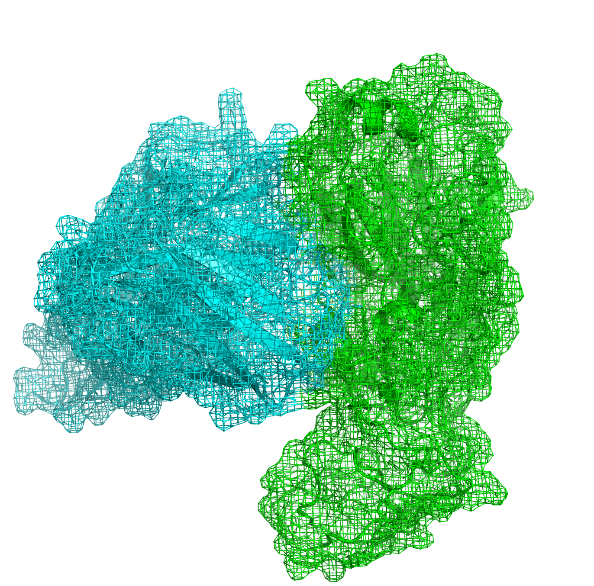

# Frankies Scalable, AI-Based  Antibody Design Pipeline
## Antibody Generation and Analysis



This repository contains a Snakemake pipeline for generating and testing antibodies using the Frankies framework. The pipeline is designed to be scalable and efficient, allowing for the generation of large numbers of antibodies and their subsequent analysis.

### The automated pipeline includes the following steps:

0. **Preprocessing**: 
    - Preprocess the input Heavy and Light sequences preparing them for use in the pipeline. This includes assessing legnth and number of sequences, ensuring the input files are passed to the Frankies framework.
1. **Generate sequences using Evodiff**: 
    - Use the Frankies framework to generate a set of antibodies based on the proprocessed Antibody sequences.
    - The generated sequences are assessed for known antibody motifs and only structurally valid sequences are kept.
2. **Generate structures using AlphaFold or ESM3**: 
    - Use the AlphaFold3 or ESM models to predict the 3D structures of the generated antibodies.
3. **Generate HADDOCK3 experiment files**:
    - Use the generated structures to create HADDOCK3 experiment files. This includes generating the input files for HADDOCK3 and setting up the docking parameters.
4. **Run HADDOCK3**:
    - Run HADDOCK3 on the generated experiment files. This includes running the docking simulations and generating the output files.
5. **Analyze HADDOCK3 results**:
    - Analyze the results of the HADDOCK3 simulations. This includes generating the output files and analyzing the docking results.
6. **Generate report**:
    - Generate a report using Quarto. This includes generating the report files and analyzing the results.


## Prerequisites
- Python 3.8 or higher
- Snakemake
- Conda
- CUDA (if using GPU)
- Quarto (for report generation)
- PyMOL (for visualization)
- Docker

## Setup Conda Environment
```bash
# conda env create -f environment.yml
# conda activate frankies

# conda deactivate
# conda env update -n frankies -f environment.yml
```

> [!NOTE]  
> You'll also need to install Quarto separately. See https://quarto.org/docs/get-started/ for instructions.


## Run Snakemake Pipeline

Entire pipeline:
```bash
# snakemake --snakefile Snakefile
```

Specific rule:
```bash
# snakemake --force make_report
```

Clear current experiment name:
```bash
# rm experiments/.current_experiment_name
```

## Run Batch of Snakemake Pipeline
```bash
# ./run_snakemake_multiple.sh
```
By default, this will run the pipeline 10 times and create a new experiment name each time. You can change the number of runs by modifying the `NUM_RUNS` variable in the script.

## Host and Drivers
This was tested on:
 - Ubuntu 22.04 with NVIDIA 560 drivers and CUDA 12.6.
 - Ubuntu 22.04 with NVIDIA 575 drivers and CUDA 12.9.
 - Windows Subsystem for Linux with Ubuntu 18.04 on an NVIDIA Titan X.
