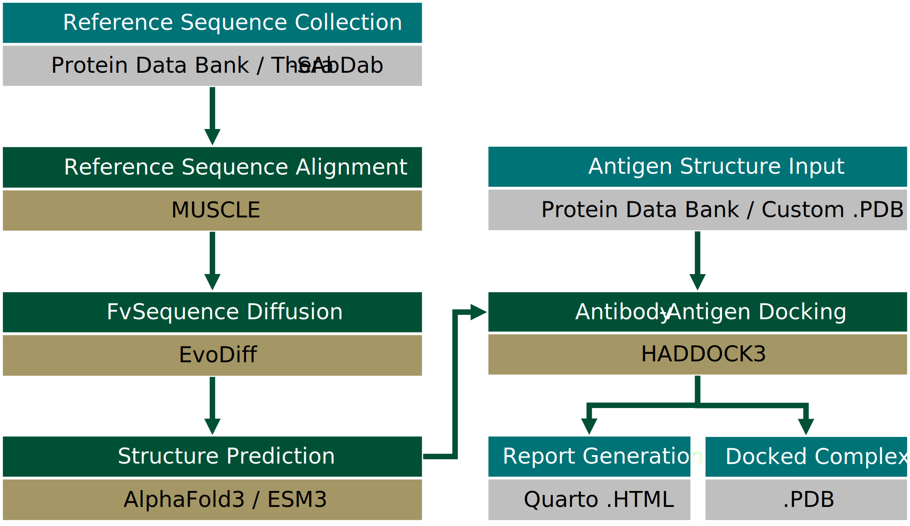

# Frankies: Scalable, AI-Based  Antibody Design Pipeline

<h3 align="right">Nicholas F. Santolla and Colby T. Ford</h3>

[](https://www.biorxiv.org/content/10.1101/2025.04.24.650061)


## Antibody Generation and Analysis


This repository contains a Snakemake pipeline for generating and testing antibodies using the Frankies framework. The pipeline is designed to be scalable and efficient, allowing for the generation of large numbers of antibodies and their subsequent analysis.

### The automated pipeline includes the following steps:

0. **Preprocessing**: 
    - Preprocess the input Heavy and Light sequences preparing them for use in the pipeline. This includes assessing legnth and number of sequences, ensuring the input files are passed to the Frankies framework.
1. **Generate sequences using EvoDiff**: 
    - Use the Frankies framework to generate a set of antibodies based on the proprocessed Antibody sequences.
    - The generated sequences are assessed for known antibody motifs and only structurally valid sequences are kept.
2. **Generate structures using AlphaFold or ESM3**: 
    - Use the AlphaFold3 or ESM models to predict the 3D structures of the generated antibodies.
3. **Generate HADDOCK3 experiment files**:
    - Use the generated structures to create HADDOCK3 experiment files. This includes generating the input files for HADDOCK3 and setting up the docking parameters.
4. **Run HADDOCK3**:
    - Run HADDOCK3 on the generated experiment files. This includes running the docking simulations and generating the output files.
5. **Analyze HADDOCK3 results**:
    - Analyze the results of the HADDOCK3 simulations. This includes generating the output files and analyzing the docking results.
6. **Generate report**:
    - Generate a report using Quarto. This includes generating the report files and analyzing the results.




## Prerequisites
- Python 3.8 or higher
- Snakemake
- Conda
- CUDA (if using GPU)
- Quarto (for report generation)
- PyMOL (for visualization)
- Docker

## Setup Conda Environment
```bash
conda env create -f environment.yml
conda activate frankies

# conda deactivate
# conda env update -n frankies -f environment.yml
```

> [!NOTE]  
> You'll also need to install Quarto separately. See https://quarto.org/docs/get-started/ for instructions.


## Modify Configurations

To set up your own run of the pipeline, simply modify the [**config.yaml**](config.yaml) file. This file contains the paths to the input files (`H_chain`/`L_chain` .a3m files, `Antigen` .pdb file, etc. ) and other parameters (`cores`, `gpus`, `tokens`, etc.)

## Run Snakemake Pipeline

Entire pipeline:
```bash
snakemake --snakefile Snakefile
```

Specific rule:
```bash
snakemake --force make_report
```

Clear current experiment name:
```bash
rm experiments/.current_experiment_name
```

## Run Batch of Snakemake Pipeline

```bash
./run_snakemake_multiple.sh
```
By default, this will run the pipeline 10 times and create a new experiment name each time. You can change the number of runs by modifying the `NUM_RUNS` variable in the script.

### Host and Drivers
This was tested on:
 - Ubuntu 22.04 with NVIDIA 560 drivers and CUDA 12.6.
 - Ubuntu 22.04 with NVIDIA 575 drivers and CUDA 12.9.
 - Windows Subsystem for Linux with Ubuntu 18.04 on an NVIDIA Titan X.


## H5N1 Antibody Generation
The pipeline was used to generate antibodies against a recent H5N1 avian influenza viral isolate (as reported in [Santolla and Ford, 2025](https://www.biorxiv.org/content/10.1101/2025.04.24.650061v1)). The input files for the pipeline are included in the `data/` directory. The generated Fv sequences, structures, and other results are included in the `experiments/` directory. 

## Citation
If you use our H5N1 experimental results or the _Frankies_ pipeline code in your research, please cite the following paper:

> Nicholas F. Santolla and Colby T. Ford. AI-Based Antibody Design Targeting Recent H5N1 Avian Influenza Strains. 
_bioRxiv_, 2025. doi: [10.1101/2025.04.24.650061](https://doi.org/10.1101/2025.04.24.650061)


```bibtex
@article {Santolla2025.04.24.650061,
	author = {Santolla, Nicholas F. and Ford, Colby T.},
	title = {{AI-Based Antibody Design Targeting Recent H5N1 Avian Influenza Strains}},
	elocation-id = {2025.04.24.650061},
	year = {2025},
	doi = {10.1101/2025.04.24.650061},
	publisher = {Cold Spring Harbor Laboratory},
	URL = {https://www.biorxiv.org/content/early/2025/04/24/2025.04.24.650061},
	eprint = {https://www.biorxiv.org/content/early/2025/04/24/2025.04.24.650061.full.pdf},
	journal = {bioRxiv}
}
```